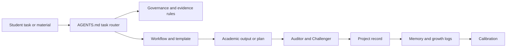

# SAIS v1 Architecture

## Purpose

SAIS is a Codex-native academic coaching system. Its durable state is the repository, not a chat transcript or an assumed model memory.

## Module contract

| Module | Owns | Must not own |
| --- | --- | --- |
| `00_system` | system intent, data governance, registries | task-specific rules |
| `01_governance` | integrity, evidence, uncertainty, quality gates | course facts or writing content |
| `02_institution` | verified programme and module context | invented local culture or unofficial marking rules |
| `03_workflows` | task sequences and required checks | durable personal records |
| `04_templates` | reusable record/output formats | individual project decisions |
| `05_projects` | active assignments and dissertation state | reusable global theory notes |
| `06_memory` | reusable, consented learning records | source PDFs or confidential raw data |
| `07_quality_control` | audits, calibration, regressions | substantive student work |

## Change control

Change a system rule only after a concrete trigger: an official rule change, repeated feedback pattern, failed test, or user-approved design decision. Record the trigger in `07_quality_control/Calibration.md`.

