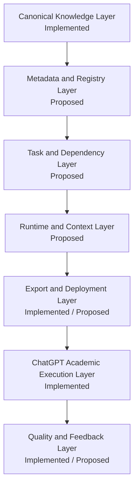

# SAIS v0.2：Target Architecture

## 架構總覽

Repository 是唯一 Canonical source。任何 export（完整 MVP、Plus Pack 或未來 task-specific pack）都只能是可追溯的 deployment artefact，不得反向成為權威來源。

## 層級定義

| Layer | 責任 | 輸入 | 輸出 | 不負責 | 依賴 | 失敗模式 | 狀態 |
|---|---|---|---|---|---|---|---|
| Canonical Knowledge | 保存治理、institutional context、knowledge、workflows、templates、QC | 經核對的 SAIS 文件與官方材料 | 可追溯的 Canonical modules | Runtime 選檔、模型呼叫 | repository discipline | 來源過期、provenance 不明、composite 被誤認為 Canonical | Implemented |
| Metadata and Registry | 描述 module 身分、版本、狀態與相依性 | Canonical module metadata | 可驗證 registry | 改寫 academic content | Canonical Knowledge | stale metadata、遺漏衝突 | Proposed |
| Task and Dependency | 將 task 對應 profile 與必要模組 | TaskRequest、registry | ResolutionResult | 產生 academic answer | metadata、AI policy、brief | 錯誤 routing、漏載 mandatory module | Proposed |
| Runtime and Context | 安全載入、排序與 budget context；產出 prompt package/trace | resolution、assignment context | ContextPackage、PromptPackage、Trace | 呼叫模型、寫 essay、儲存 memory | approved modules | context 超限、權威覆蓋錯誤、漏記 omission | Proposed |
| Export and Deployment | 產生 full/Plus/task-specific export、instructions 與 checklist | repository modules、validation result | 可部署 Pack | 成為 Canonical source | Canonical Knowledge、validation | summary/compression、版本混用、漏檔 | Full/Plus Implemented；automation Proposed |
| ChatGPT Academic Execution | 依已上傳 Pack 分析、解釋、規劃、revision 與 audit | uploaded knowledge、user materials | coaching response 與 gaps | 存取本地 repo、控制 Codex、保證成績 | user-provided brief/rubric/AI rule | 缺輸入、誤用舊 pack、過度推論 | Implemented |
| Quality and Feedback | 套用 Auditor、Challenger、integrity/citation/claim checks；記錄可回饋問題 | draft、evidence、QC modules | findings、warnings、next action | 保證成績或取代 marker | QC modules、current rubric | QC 被當分數、未驗證來源 | QC Implemented；feedback loop Proposed |

## Layer 1：Knowledge

Layer 1 包含 Governance、Institutional context、Knowledge、Workflows、Templates 與 Quality Control。它的責任是保存可追溯規則與操作材料；它不應因 export 限制被改寫。`Academic_Constitution.md` 仍是 export-only attributed composite，`AOCOM_Lite.md` 仍是 MVP operational composite；兩者都必須顯示其非正式 Canonical module 狀態。

## Layer 2：Runtime

**Proposed** 的最小 Runtime 由下列元件組成：Task Router、Dependency Resolver、Module Loader、Context Manager、Prompt Builder 與 Execution Trace。它只組裝可驗證的 context；不呼叫模型、不自動撰寫或提交 coursework，也不建立 memory/retrieval/agent 系統。

## Layer 2.5：ChatGPT Knowledge Pack

- **Implemented**：Full Pack、Plus Pack、Project Instructions、Deployment checklist。
- **Proposed**：task-specific Pack，僅在 manual export 成為被證明的痛點後評估。
- **Constraint**：Plus Pack 保持 12-file Project Knowledge deployment，local-only 文件不得上傳；lossless merge 不得移除 substantive content。

## Layer 3：Optional Tool Integration

以下全部為 **Deferred**，不是 v0.2 必做內容：Document parsing、Source ingestion、API、Memory、Retrieval、Agent tools。只有 manual workflow 明顯無法滿足真實需求時，才可由明確 evidence 啟動評估。

## ChatGPT / Codex 分工

### Codex

- repository maintenance；architecture development；validation；export；packaging；Git operations；local tooling。

### ChatGPT

- brief analysis；source analysis；argument development；revision；audit；explanation；interactive academic support。

### 目前不能做到

- ChatGPT 不能直接執行本地 Codex Runtime。
- Codex 不能自動控制 ChatGPT Project。
- 兩者不能自動共享 live memory。
- ChatGPT 不能自動看到未上傳的 repository 文件。

這些限制是系統邊界，不是可由 prompt 假裝消除的能力。
